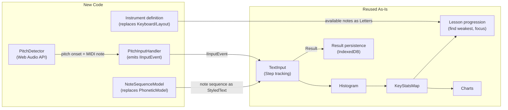
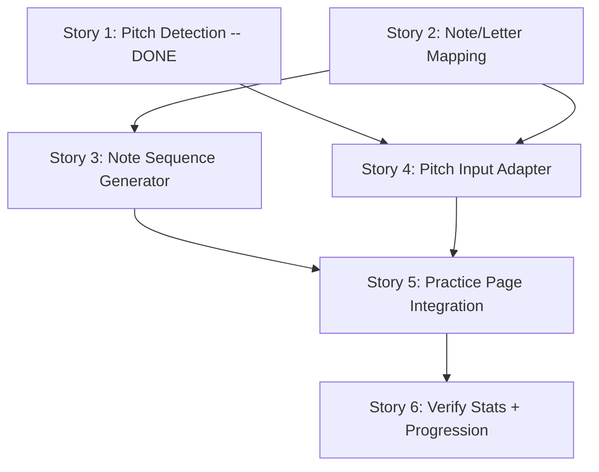

# keybr-music: Bandoneon Practice Proof of Concept

## Architecture

The existing keybr pipeline stays intact. We replace three boundary layers and add one new package:




The critical insight: MIDI note numbers (0-127) are valid `CodePoint` values. A `Letter` of `new Letter(60, 0.15, "C4")` flows through `Step`, `Histogram`, and `KeyStatsMap` without modification.

---

## Story 1: Pitch Detection Module -- COMPLETED

**Status:** Done. Merged to master. PR #1 (pitch detection) and PR #2 (test page + noise floor).

**Package:** `packages/keybr-pitch-detection/`

Standalone pitch detector using Web Audio API + YIN autocorrelation.

**What was built:**

- `YinPitchAnalyzer` -- YIN autocorrelation algorithm with difference function, cumulative mean normalized difference, absolute threshold with trough-finding, and parabolic interpolation for sub-sample accuracy. Reuses allocated buffers across calls for performance.
- `StablePitchProcessor` -- Debounce layer requiring N consecutive frames with the same MIDI note before emitting. Filters low-confidence detections. Resets on silence (null frames). Note: emits on every frame once stable, not just on onset -- downstream consumers must deduplicate sustained notes.
- `WebAudioPitchDetector` -- Wires Web Audio API (`getUserMedia` -> `AudioContext` -> `AnalyserNode` -> `getFloatTimeDomainData`) with a `requestAnimationFrame` loop feeding YIN + processor. Configurable buffer size, frequency range, confidence threshold, stable frames, and noise floor.
- `rms()` -- Exported utility computing root-mean-square amplitude of a signal buffer.
- Noise floor gating -- RMS amplitude gate skips pitch detection entirely when signal is below configurable threshold (default 0.01). Eliminates false detections from ambient room noise.
- `onLevel` callback -- Fires every frame with current RMS level for UI visualization.
- `frequencyToMidiNote()` -- Standard `69 + 12 * log2(f/440)` conversion, clamped to 0-127.

**Test page:** `packages/page-pitch-test/` at route `/pitch-test`. Start/stop controls, large current-note display, log table (note name, MIDI number, frequency, confidence, inter-note delta ms), live RMS level meter with adjustable noise floor slider. Fully wired into routing (browser + server) and navigation.

**Interfaces:**

```typescript
type PitchEvent = {
  readonly timeStamp: number;
  readonly midiNote: number;
  readonly frequency: number;
  readonly confidence: number;
};

type PitchDetector = {
  start(): Promise<void>;
  stop(): void;
  onPitch: (event: PitchEvent) => void;
  onLevel: (rms: number) => void;
};

type PitchDetectorOptions = {
  readonly bufferSize?: number;     // default 2048
  readonly minFrequency?: number;   // default 50
  readonly maxFrequency?: number;   // default 2000
  readonly minConfidence?: number;  // default 0.7
  readonly stableFrames?: number;   // default 2
  readonly yinThreshold?: number;   // default 0.12
  readonly noiseFloor?: number;     // default 0.01
};
```

**Findings from live testing on bandoneon:**

- Pitch detection accuracy is good across the instrument's range.
- Ambient noise was the primary issue -- solved by RMS noise floor gating.
- Some notes in the middle/low range initially detect at the wrong octave (one octave up) for a few frames before settling. Cause: the bandoneon has two reeds per note; the smaller (higher) reed speaks first. This is a known artifact to be handled in Story 4 (pitch input adapter), not in the detector.

**Dev setup note:** Requires `.env.development` with `APP_URL=http://localhost:3000/` for local development (gitignored; see `.env.example` for template).

---

## Story 2: Note/Letter Mapping and Instrument Definition

**Package:** `packages/keybr-instrument/`

Define the mapping from MIDI notes to `Letter` instances and the set of available notes for an instrument.

**Key files to model after:**

- [packages/keybr-phonetic-model/lib/letter.ts](packages/keybr-phonetic-model/lib/letter.ts) -- `Letter` class (reuse directly)
- [packages/keybr-keyboard/lib/keyboard.ts](packages/keybr-keyboard/lib/keyboard.ts) -- `getCodePoints()` returns `WeightedCodePointSet`

**Implementation:**

```typescript
type Instrument = {
  readonly id: string;
  readonly name: string;
  readonly letters: readonly Letter[];
  readonly codePoints: WeightedCodePointSet;
};

// Bandoneon: roughly A2 (45) to A6 (93)
// Start with a single octave for PoC: C4 (60) to B4 (71)
function bandoneon(): Instrument { ... }
```

- Each note becomes a `Letter`: `new Letter(midiNote, relativeFrequency, noteName)`
- `relativeFrequency` can be uniform initially (all notes equally weighted)
- `WeightedCodePointSet` wraps the MIDI note set with uniform weights (no home-row advantage equivalent yet)
- Note labels: "C4", "C#4", "D4", etc.

**Test plan:**

- Unit test: `Letter` instances created for each note in range, labels are correct
- Unit test: `WeightedCodePointSet` contains exactly the expected MIDI notes
- Unit test: `Letter.frequencyOrder()` and `Letter.restrict()` work with note Letters

---

## Story 3: Note Sequence Generator

**Package:** add to `packages/keybr-instrument/`

Replace the phonetic model's word generation with note sequence generation that respects the `Filter` abstraction.

**Key interface to match** (from [packages/keybr-phonetic-model/lib/filter.ts](packages/keybr-phonetic-model/lib/filter.ts)):

```typescript
class Filter {
  readonly codePoints: CodePointSet;
  readonly focusedCodePoint: CodePoint;
}
```

**Implementation:**

- `NoteSequenceModel` implements or mirrors `PhoneticModel.nextWord(filter, rng)`
- Generates short sequences (3-8 notes) from `filter.codePoints`
- `focusedCodePoint` appears in ~50% of sequences
- Pattern types (start simple, expand later):
  - **Ascending/descending runs** through included notes
  - **Neighbor patterns**: focused note + adjacent notes
  - **Random from included set**

**Decision: encoding.** Each note is one `CodePoint` (MIDI number). A sequence of 6 notes is 6 characters. No spaces, no word boundaries. The text display shows the `Letter.label` for each character. This means the display in `TextArea` needs to render labels instead of raw characters -- but the `Char` type already has display attributes via `StyledText`.

**Test plan:**

- Unit test: generated sequences only contain notes from `filter.codePoints`
- Unit test: focused note appears with expected frequency
- Unit test: sequences have length within expected bounds
- Unit test: sequences are valid (no repeated adjacent notes, optionally)

---

## Story 4: Pitch Input Adapter

**Package:** `packages/keybr-pitch-input/`

Bridge between `PitchDetector` (Story 1) and `TextInput.onInput()` via the `IInputEvent` interface.

**Key interface to target** (from [packages/keybr-textinput-events/lib/types.ts](packages/keybr-textinput-events/lib/types.ts)):

```typescript
type IInputEvent = {
  readonly type: "input";
  readonly timeStamp: number;
  readonly inputType:
    | "appendChar"
    | "appendLineBreak"
    | "clearChar"
    | "clearWord";
  readonly codePoint: CodePoint;
  readonly timeToType: number;
};
```

**Implementation:**

- Wraps `PitchDetector`
- On each stable `PitchEvent`, emits `IInputEvent` with:
  - `inputType: "appendChar"`
  - `codePoint: pitchEvent.midiNote`
  - `timeToType: pitchEvent.timeStamp - lastPitchTimeStamp`
- First note in a sequence gets `timeToType: 0` (same convention as keybr's first character)
- Must deduplicate sustained notes -- `StablePitchProcessor` emits on every frame once stable, so the adapter must only emit an `IInputEvent` when the MIDI note changes
- No `clearChar`/`clearWord` -- you can't "backspace" a played note. Set `forgiveErrors: true` mode so the system auto-recovers from wrong notes (this mode already exists in `TextInput`)
- React component: `PitchEvents` (replaces `TextEvents` from [packages/keybr-textinput-events/lib/TextEvents.tsx](packages/keybr-textinput-events/lib/TextEvents.tsx))

**Octave correction (reed artifact suppression):**

The bandoneon has two reeds per note; the smaller reed speaks first. For some notes in the middle/low range, the detector reports the wrong octave (one octave up) for the first few frames before the primary reed stabilizes. This manifests as a spurious octave-up note immediately before the correct note.

The adapter handles this with a temporal octave correction rule:

- When a new note N1 is detected and then within ~30ms (2 rAF frames) the note changes to N2 where N2 is exactly 12 semitones below N1 (same pitch class, one octave down), suppress N1 and emit N2 as the onset.
- If N1 is followed by a different pitch class, emit N1 immediately.
- The correction only applies to the downward direction (high-to-low octave jump within onset), since the artifact is always the higher reed speaking first.

This adds zero latency for normal note transitions and at most ~~30ms for notes affected by the reed artifact. At sixteenth notes at 160 BPM (~~94ms per note), this is acceptable.

Note: range constraining (snapping to expected notes) does NOT solve this because the exercise typically spans multiple octaves, so the wrong-octave note is often a valid note in the set. The correction must be temporal.

**Test plan:**

- Unit test: mock `PitchDetector` emits sequence of pitches, verify correct `IInputEvent` stream
- Unit test: `timeToType` calculated correctly as delta between consecutive pitches
- Unit test: octave correction -- emit C5 then C4 within 30ms, verify only C4 is emitted
- Unit test: octave correction -- emit C5 then D4 (different pitch class), verify C5 is emitted immediately
- Unit test: octave correction -- emit C5, wait >30ms, emit C4, verify both are emitted as separate notes
- Unit test: first note in sequence has `timeToType: 0`
- Unit test: silence gaps (no pitch detected for N ms) do not produce spurious events
- Unit test: sustained note (same MIDI note repeated) only emits one `IInputEvent`

---

## Story 5: Practice Page Integration

Wire everything together into a working practice flow.

**Key files to modify:**

- [packages/page-practice/lib/practice/Controller.tsx](packages/page-practice/lib/practice/Controller.tsx) -- swap `emulateLayout`/`TextEvents` for `PitchEvents`
- [packages/page-practice/lib/PracticePage.tsx](packages/page-practice/lib/PracticePage.tsx) -- add music mode toggle or route
- [packages/keybr-lesson-loader/lib/LessonLoader.tsx](packages/keybr-lesson-loader/lib/LessonLoader.tsx) -- load `NoteSequenceModel` + `Instrument` instead of `PhoneticModel` + `Keyboard`
- [packages/keybr-lesson/lib/guided.ts](packages/keybr-lesson/lib/guided.ts) -- adapt `GuidedLesson` to accept `NoteSequenceModel` (or create `MusicLesson` subclass)
- [packages/keybr-result/lib/result.ts](packages/keybr-result/lib/result.ts) -- `Layout` in `Result` needs a workaround (use a placeholder `Layout` for now, or make it optional)

**Minimal changes for PoC:**

1. Create a `MusicLesson` class extending `Lesson` that uses `NoteSequenceModel` and `Instrument` instead of `PhoneticModel` and `Keyboard`
2. Create `MusicController` component that uses `PitchEvents` instead of `TextEvents`/`emulateLayout`
3. Add a route or toggle for music mode
4. Use "Bare" layout (no keyboard visual) -- this already exists and works
5. For `Result.layout`, create a single placeholder `Layout` entry (e.g. `Layout.BANDONEON`) registered in `Layout.ALL` -- ugly but minimal

**Display:** Note names as text in the existing `TextArea`. Each "character" displays as its `Letter.label` ("C4", "D4", etc.). This requires the text rendering to use labels instead of `String.fromCodePoint()`. Check how `Char` and `StyledText` render -- may need a small adapter in `keybr-textinput-ui`.

**Test plan:**

- Integration test: mock pitch detector feeds notes, verify `TextInput` advances through the sequence
- Integration test: completing a sequence produces a `Result` with correct histogram
- Integration test: `KeyStatsMap` accumulates per-note stats across multiple results
- Manual end-to-end test: open music mode, play bandoneon into mic, see notes register, complete a lesson, see speed (notes per minute) and per-note stats

---

## Story 6: Verify Stats and Lesson Progression

No new code expected -- this story is about verifying the existing pipeline works with note data.

**What should work automatically:**

- `Histogram` tracks `hitCount`, `missCount`, `timeToType` per MIDI note
- `KeyStatsMap` smooths `timeToType` over time, tracks `bestTimeToType`
- `GuidedLesson.update()` (or `MusicLesson.update()`) finds the note with worst `timeToType` and focuses on it
- Speed (notes per minute) = `(length / (time / 1000)) * 60`
- Charts display per-note performance over time

**Test plan:**

- Unit test: feed synthetic `Result` objects with note-based histograms through `makeKeyStatsMap()`, verify per-note stats
- Unit test: verify lesson progression correctly identifies weakest note and includes/focuses it
- Manual test: play several rounds, verify the system adds new notes when existing ones reach target speed, and focuses on the slowest note

---

## Implementation Order

Story 1 is complete. Stories 2-4 are next. Story 2 is independent. Story 3 depends on 2 (needs `Letter` and `Instrument` definitions to generate sequences from). Story 4 depends on 1 and 2 (needs `PitchDetector` for input, and `Instrument` to know the valid note set for deduplication context). Story 5 depends on 3 and 4. Story 6 is verification of 5.

Recommended batching: Stories 2+3 together, then Story 4, then Stories 5+6 together.




## Risks

- **Pitch detection accuracy on bandoneon:** Validated -- works well. Main issue was ambient noise (solved by noise floor gating). Reed octave artifact exists on some middle/low notes but is well-characterized and will be handled in Story 4.
- **Detection latency vs timeToType precision:** ~46ms detection window plus ~32ms stabilization means ~80ms floor on note onset detection. At practice tempos this is acceptable. At very fast passages (sixteenth notes at 160 BPM = 94ms per note) the margin is tight but workable. Buffer size can be tuned down if needed.
- **Display of note names:** `TextArea` renders characters via `String.fromCodePoint()`. MIDI notes 45-93 map to ASCII characters like `-` through `]`, which is nonsensical. Need to intercept rendering to show `Letter.label` instead. This may require changes in `keybr-textinput-ui`. To be investigated in Story 5.

